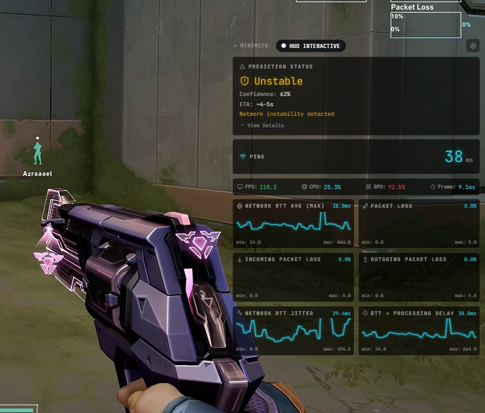
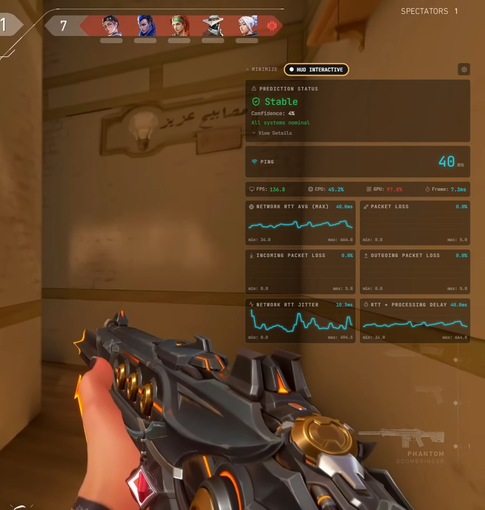
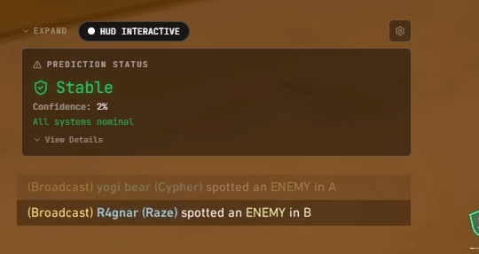
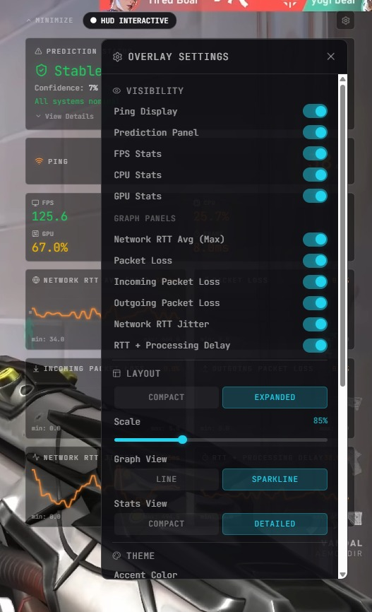
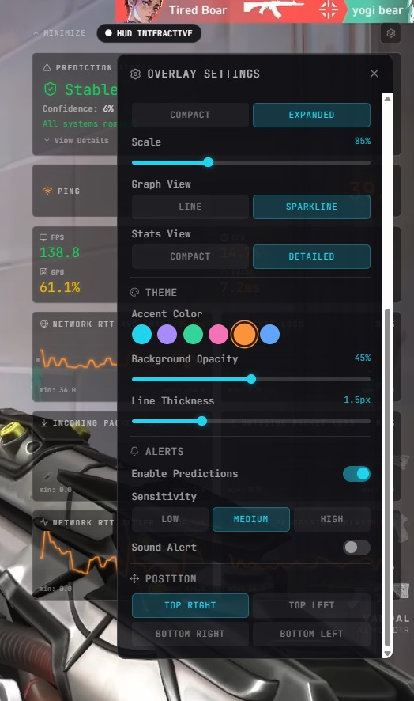
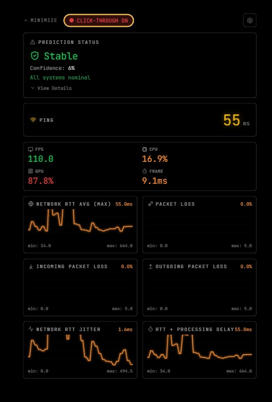

<div align="center">

# LagGuard

### Real-time Network Prediction Overlay for Gamers & Streamers

A lightweight desktop overlay that predicts lag spikes before they happen using live network analysis and machine learning.

<br>



<br><br>


</div>

---

## About

LagGuard is a predictive network monitoring overlay built for latency-sensitive applications like competitive gaming and live streaming.

Instead of showing lag after it happens, LagGuard continuously analyzes network behaviour in real time and warns users before instability becomes noticeable in-game.

The overlay is designed to stay lightweight, minimal, and distraction-free while remaining visible on top of fullscreen applications.

---

# Preview

## Warning Prediction


---

## Stable Connection State



---

## Compact Overlay Mode



---

## Settings Panel



---

## Theme Customization



---

## Minimal Overlay UI



---

# Features

- Real-time latency monitoring
- Jitter and packet loss analysis
- Predictive lag detection
- XGBoost-based ML predictions
- Frameless Electron overlay
- Click-through transparent UI
- WebSocket live communication
- Gaming optimized interface
- Lightweight background processing
- Configurable alerts and thresholds

---

# Tech Stack

| Layer | Technology |
|---|---|
| Frontend | Electron + HTML/CSS |
| Backend | Node.js |
| Machine Learning | XGBoost |
| Communication | WebSockets |
| Monitoring | ICMP / Ping Sampling |

---

# Architecture

```text
 Network Sampling
        │
        ▼
 Feature Extraction
        │
        ▼
 Prediction Engine
 (Rules + XGBoost)
        │
        ▼
  WebSocket Stream
        │
        ▼
 Electron Overlay
```

---

# Installation

## Clone the repository

```bash
git clone https://github.com/yourusername/lagguard.git
cd lagguard
```

## Install dependencies

```bash
npm install
```

## Start development build

```bash
npm run dev
```

## Build application

```bash
npm run build
```

---

# Usage

Run the application:

```bash
npm start
```

Configure monitoring settings inside:

```text
config.json
```

Example:

```json
{
  "target": "8.8.8.8",
  "interval": 500,
  "predictionThreshold": 0.75
}
```

---

# Prediction States

| State | Meaning |
|---|---|
| Stable | Network healthy |
| Warning | Possible lag incoming |
| Danger | High probability lag spike |

---

# Roadmap

- Historical analytics dashboard
- Cloud synced profiles
- Game-specific presets
- Discord notifications
- Mobile companion app
- Multi-server monitoring
- Advanced ML training pipeline

---

# Contributing

Pull requests are welcome.

If you'd like to contribute:

```bash
fork -> clone -> develop -> pull request
```

---

# License

MIT License

---

<div align="center">

### If you like the project, consider starring the repository ⭐

</div>
